## DNS (Domain Name System)
DNS is the phone book of the Internet that translates human-readable domain names into machine-readable IP addresses.


**Simple analogy:** DNS is like asking for directions 🗺️ – "Where is Google's office?" → "It's at 1600 Amphitheatre Parkway."

### Why DNS Exists

```mermaid
graph LR
    subgraph "Without DNS"
        A1[User] -->|Remember this?| B1[142.250.72.14]
        B1 -->|Hard for humans| C1[Confusion 😵]
    end
    
    subgraph "With DNS"
        A2[User] -->|Type this| B2[google.com]
        B2 -->|DNS translates to| C2[142.250.72.14]
        C2 -->|Easy for humans| D2[Success 🎉]
    end
    
    style C1 fill:#ffcdd2
    style D2 fill:#c8e6c9
```



### The Problem DNS Solves:
| Human Perspective | Computer Perspective | Solution       |
|------------------|----------------------|---------------|
| google.com       | 142.250.72.14        | DNS translates |
| github.com       | 140.82.121.3          | DNS translates |
| amazon.com       | 54.239.28.85          | DNS translates |


**Without DNS:** You'd need to memorize IP addresses for every website!

### DNS Resolution Flow


**Resolution Time:** ~20-120ms ⚡ (cached results: ~1ms)

### DNS Hierarchy Architecture

```mermaid
graph TB
    subgraph "DNS Hierarchy"
        Root["🌐 Root Servers (13 worldwide)<br/>. (dot)"]
        
        Root --> TLD1["🏷️ TLD Servers<br/>.com .org .net"]
        Root --> TLD2["🏷️ TLD Servers<br/>.uk .de .jp"]
        Root --> TLD3["🏷️ TLD Servers<br/>.edu .gov .mil"]
        
        TLD1 --> Auth1["📚 Authoritative Servers<br/>google.com"]
        TLD1 --> Auth2["📚 Authoritative Servers<br/>github.com"]
        
        Auth1 --> Cache["💾 Local DNS Cache<br/>(Recursive Resolver)"]
        Cache --> User["👤 End User<br/>Browser/Device"]
    end
    
    style Root fill:#ffccbc
    style TLD1 fill:#c8e6c9
    style TLD2 fill:#c8e6c9
    style TLD3 fill:#c8e6c9
    style Auth1 fill:#bbdefb
    style Auth2 fill:#bbdefb
    style Cache fill:#fff9c4
    style User fill:#e1f5fe
```


### DNS Server Types Explained:
| Server Type           | Role                           | Example             | Managed By                        |
|----------------------|---------------------------------|---------------------|-----------------------------------|
| Recursive Resolver   | First contact, caches results  | Your ISP's DNS, Google DNS | ISPs, Google, Cloudflare     |
| Root Server          | Knows TLD servers               | 13 clusters worldwide | ICANN                          |
| TLD Server           | Manages domain extensions        | .com, .org, .net servers | Registry operators              |
| Authoritative Server | Final source of truth            | ns1.google.com       | Domain owner                      |


### DNS Record Types (Most Important)


### Essential DNS Records:
| Record | Purpose                          | Example                                      | TTL    |
|------|----------------------------------|----------------------------------------------|-------|
| A    | Maps to IPv4 address             | example.com → 192.0.2.1                      | 300s  |
| AAAA | Maps to IPv6 address             | example.com → 2001:db8::1                    | 300s  |
| CNAME| Alias to another domain          | www → example.com                             | 300s  |
| MX   | Mail exchange server              | 10 mail.example.com                           | 3600s |
| TXT  | Text records (verification)        | "v=spf1 include:_spf.google.com ~all"        | 3600s |
| NS   | Name servers for domain            | ns1.cloudflare.com                            | 172800s |
| SOA  | Start of Authority                 | Zone admin info                                | 3600s |


### Popular DNS Providers


### DNS Provider Comparison:
| Provider     | Speed   | Security     | Features                          | Best For          |
|-------------|--------|-------------|------------------------------------|------------------|
| Cloudflare  | ⚡ Fast | 🔒 Excellent | Free, DDoS protection             | Everyone         |
| Google DNS  | ⚡ Fast | 🔒 Good      | Simple, reliable                   | General use       |
| Amazon Route 53 | ⚡ Fast | 🔒 Excellent | Enterprise, health checks          | AWS users         |
| OpenDNS     | Fast   | 🔒 Good      | Family filtering, security          | Families          |
| Quad9       | Fast   | 🔒 Excellent | Malware blocking                     | Security-focused  |

### DNS in Modern Web Architecture


### DNS Commands & Tools
```bash
# Basic DNS lookup
nslookup google.com
dig google.com

# Specific record types
dig google.com A          # IPv4
dig google.com AAAA       # IPv6
dig google.com MX         # Mail servers
dig google.com NS         # Name servers
dig google.com TXT        # Text records

# Trace DNS resolution
dig google.com +trace
dig @8.8.8.8 google.com   # Use specific DNS server

# Reverse DNS lookup (IP to domain)
dig -x 142.250.72.14
nslookup 142.250.72.14

# Check DNS propagation
dig @8.8.8.8 example.com  # Check Google's cache
dig @1.1.1.1 example.com  # Check Cloudflare's cache

# Query specific DNS server
dig @ns1.google.com google.com

# Continuous monitoring
watch -n 5 'dig example.com'
```