## Domain vs Hosting vs Server

These three components work together to make websites accessible online, each serving a distinct but interconnected role in the digital ecosystem.

```mermaid
flowchart TD
    A[User Types<br/>example.com] --> B[🌐 Domain<br/>Name/Address]
    B --> C[🔍 DNS Lookup]
    C --> D[🏢 Hosting Provider]
    D --> E[💻 Server<br/>Physical/Virtual Machine]
    E --> F[📄 Website Files<br/>HTML/CSS/JS/DB]
    F --> G[👤 User Sees Website]
    
    style B fill:#e1f5fe
    style D fill:#c8e6c9
    style E fill:#ffccbc
    style F fill:#d1c4e9
```



**Simple analogy:**
- **Domain** = Your business card 📇 (tells people where to find you)
- **Hosting** = Your office building 🏢 (space where your business operates)
- **Server** = Your office equipment 💻 (computers, phones, tools to do work)

### What is a Domain?
A domain is the human-friendly name of a website.

**Examples:**
- google.com
- yoursite.com
- api.mysite.com

Instead of typing an IP like 192.168.1.23, we use domains.

A domain is purchased from:
- Namecheap
- GoDaddy
- Google Domains

A domain is just a name, it holds nothing by itself.


#### Domain Characteristics:
- **Purpose:** Human-readable website address
- **Format:** subdomain.domain.tld (e.g., www.example.com)
- **Cost:** Typically $10-$20/year
- **Renewal:** Annual subscription model
- **Management:** DNS records control where domain points

#### Domain Structure:
```txt
┌─────────────────────────────────────────┐
│         Complete Domain Breakdown        │
├─────────────────────────────────────────┤
│   https://www.example.com:443/path      │
│   │     │   │        │   │     │       │
│   │     │   │        │   │     └─ Path │
│   │     │   │        │   └─ Port       │
│   │     │   │        └─ Second-Level   │
│   │     │   └─ Top-Level Domain (.com) │
│   │     └─ Subdomain (www)             │
│   └─ Protocol (HTTPS)                  │
└─────────────────────────────────────────┘
```

#### DNS Records Explained:
```yaml
# example.com DNS configuration:
A Record:      example.com → 192.0.2.1
CNAME Record:  www → example.com
MX Records:    @ → mail.example.com (priority 10)
TXT Records:   "v=spf1 include:_spf.google.com ~all"
NS Records:    ns1.hostingprovider.com
```

### What is Hosting?
Hosting is the service that stores your website files and makes them accessible online.

This includes:
- HTML, CSS, JavaScript
- Images & videos
- Backend code
- Databases

Hosting providers:
- Vercel
- Netlify
- Railway
- Hostinger
- AWS
- DigitalOcean

Hosting is the storage + service that puts your site online.


### Hosting Provider Landscape

| Type              | Description                       | Best For                 | Price Range      |
|------------------|-----------------------------------|--------------------------|------------------|
| Shared Hosting    | Multiple sites on one server      | Beginners, small sites   | $3–$10 / month   |
| VPS Hosting       | Virtual private server            | Growing sites, developers| $10–$50 / month  |
| Cloud Hosting     | Scalable, pay-as-you-go           | Variable traffic sites   | $5–$100+ / month |
| Managed Hosting   | Provider handles maintenance      | Businesses, agencies     | $20–$300 / month |
| Dedicated Server  | Entire physical server            | High-traffic, enterprise | $80–$500+ / month|


### What is a Server?
A server is an actual computer that:
- Receives requests
- Runs code
- Sends responses
- Manages data

A server runs:
- Nginx / Apache
- Node.js / Laravel / Django
- Databases

A server is the brain & engine of a hosted website.


### How They Work Together
**Example:** You build a website for a client:
- You buy a domain: mybusiness.com
- You rent hosting: Vercel
- Vercel uses a server: to run your code

**DNS connects:**
mybusiness.com → server IP

Users can now access the site ✅