## How does the Internet Works?
The Internet is a global system that connects millions of devices so they can share data with each other. When you open a website, send a message, or stream a video, your device communicates with other computers around the world through a complex network of cables, servers, and protocols.

### Core Concept
The Internet is a global network of connected devices communicating via shared rules (protocols).

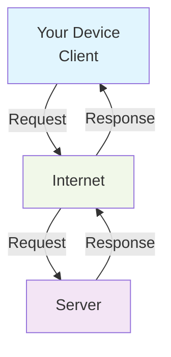

###  1. Devices & Roles

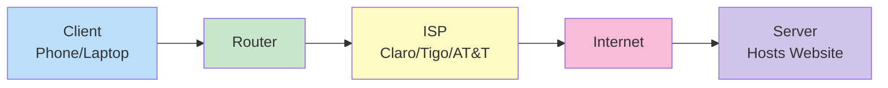

| Component | Description | Example |
|----------|-------------|---------|
| Client  | Device requesting data | Your phone, laptop, browser |
| Server  | Powerful computer responding with data | Web server, API server |
| Router  | Directs traffic between networks | Home Wi-Fi router |
| ISP     | Your gateway to the Internet | Claro, Tigo, AT&T, Spectrum |

**Flow:** Device → Router → ISP → Internet → Server

### 2. Addressing System
#### IP Address

- Unique identifier for each device (192.168.1.1 or 2001:0db8:85a3:: )
- Like a street address for computers

#### Domain Names
- Human-readable names for IP addresses

**Example:** google.com → 142.250.185.78

#### DNS (Domain Name System)
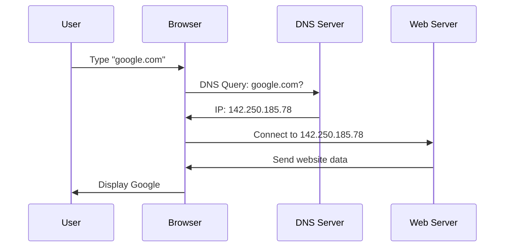

> **DNS = Internet's phonebook**

### 3. Data Transmission
Information doesn’t travel as one big file. It’s broken into small packets.

Each packet contains:

- Part of the data
- The destination address
- Instructions to reassemble

Routers send packets through the best path to reach the destination.

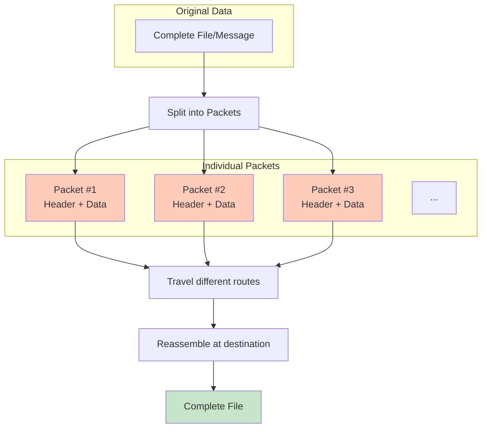

#### Protocols (Communication Rules)
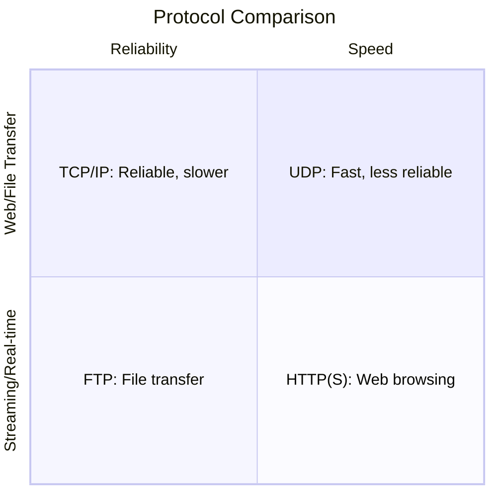

| Protocol    | Purpose                | Use Case              |
|------------|------------------------|----------------------|
| HTTP/HTTPS | Website loading        | https://website.com  |
| TCP/IP     | Reliable data delivery | Web pages, emails    |
| UDP        | Fast, less reliable     | Video calls, games   |
| FTP        | File transfer           | Uploading files      |
| SMTP       | Email sending           | Gmail, Outlook       |

> **HTTPS = HTTP + Encryption (SSL/TLS)**

### 4. Website Architecture

#### Frontend vs Backend
- **Frontend:** What users see (HTML, CSS, JavaScript, React, Next.js)
- **Backend:** Logic, data, users, authentication (Node.js, Laravel, Django)

**When you click a button:** That action triggers the backend, which processes it and sends a response to the frontend.

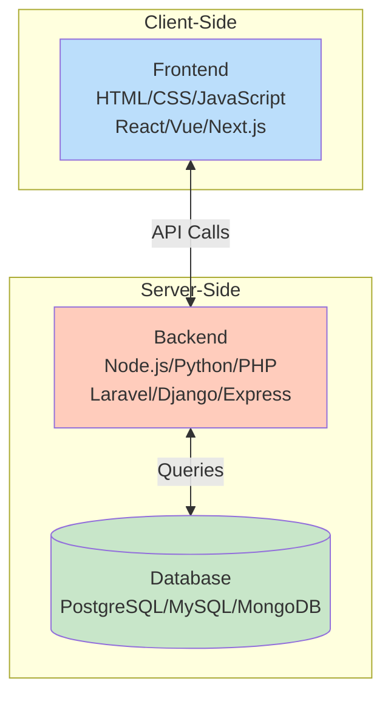

#### API (Application Programming Interface)
- **API:** A communication bridge between frontend and backend.
- **Database:** Stores data (PostgreSQL, MySQL, MongoDB).

**Example:**
- User logs in
- Frontend → API → Database
- Database → API → Frontend (response)

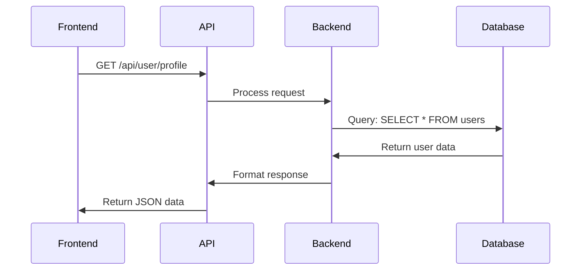

### 5. Performance & Scaling
#### Caching & CDN
To make the web faster:

- **Cache:** Stores frequent data for faster access
- **CDN (Content Delivery Network):** Delivers content from the nearest server worldwide

**Examples:** Cloudflare, Fastly, AWS CloudFront

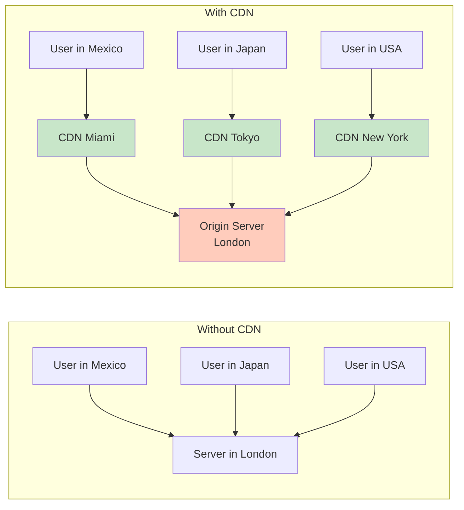

**Popular CDNs:** Cloudflare, Fastly, AWS CloudFront

### 6. Security Essentials

#### Security Layers:
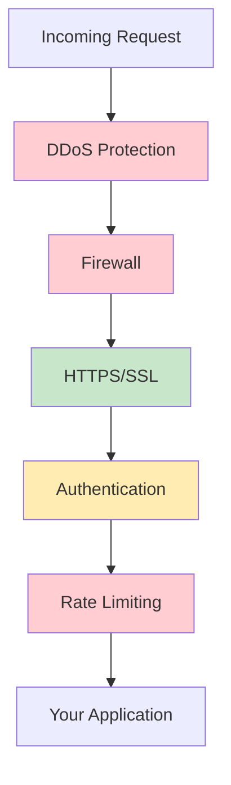

#### Common Security Tools
- **JWT Tokens:** Secure user sessions
- **OAuth:** "Login with Google/Facebook"
- **CORS:** Controls cross-origin requests
- **Encryption:** SSL/TLS certificates

### Complete Flow Example
**Visiting** https://example.co

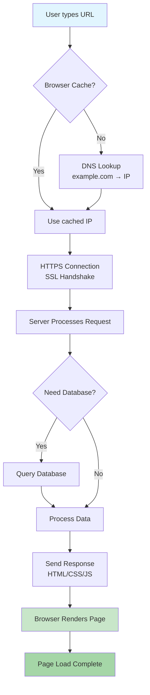

### Hosting Ecosystem
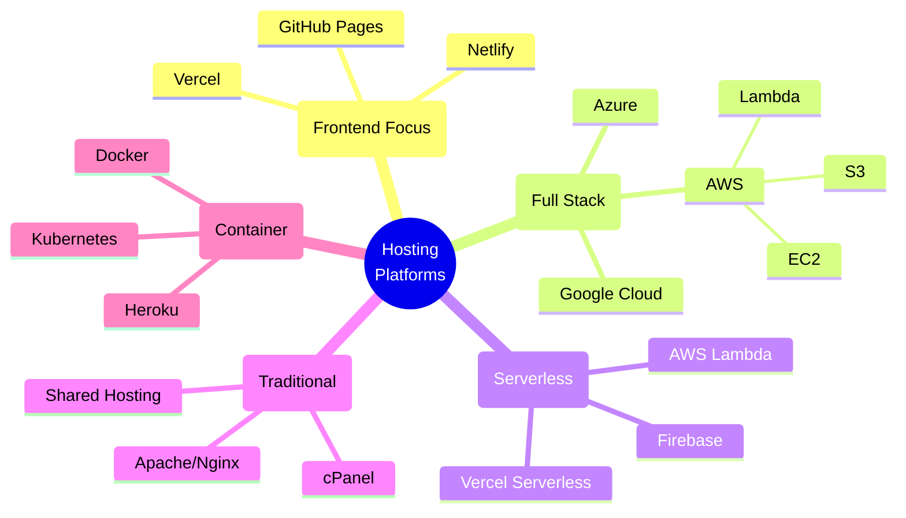

### Testing Commands

```bash
# Check DNS resolution
nslookup google.com
dig example.com

# See full request/response
curl -v https://example.com

# Check SSL certificate
openssl s_client -connect example.com:443

# Trace network path
traceroute google.com  # Linux/Mac
tracert google.com     # Windows
```