## HTTP Status Codes
HTTP Status Codes are 3-digit numbers returned by servers to indicate the result of a client's request, serving as the universal language for HTTP communication.

```mermaid
flowchart TD
    A[Client Request] --> B{Server Processing}
    B --> C[✅ 2xx Success]
    B --> D[⚠️ 3xx Redirection]
    B --> E[❌ 4xx Client Error]
    B --> F[💥 5xx Server Error]
    
    C --> G[Request Successful]
    D --> H[Additional Action Needed]
    E --> I[Client Made Mistake]
    F --> J[Server Failed]
    
    style C fill:#c8e6c9
    style D fill:#fff9c4
    style E fill:#ffccbc
    style F fill:#ffcdd2
```



**Simple analogy:** Like restaurant service codes 🍽️
- **200** = Order successful, food served
- **301** = Restaurant moved to new location
- **400** = You ordered something not on menu
- **401** = Need to show ID first
- **403** = VIP section, you can't enter
- **404** = Dish doesn't exist
- **500** = Kitchen fire, can't cook now

### Status Code Categories Overview

```mermaid
graph TD
    A[HTTP Status Codes] --> B[1xx Informational]
    A --> C[2xx Success]
    A --> D[3xx Redirection]
    A --> E[4xx Client Error]
    A --> F[5xx Server Error]
    
    B --> B1["💡 Continue processing<br/>100 Continue, 101 Switching Protocols"]
    C --> C1["✅ Request successful<br/>200 OK, 201 Created"]
    D --> D1["🔄 Redirect needed<br/>301 Moved, 304 Not Modified"]
    E --> E1["❌ Client mistake<br/>400 Bad Request, 404 Not Found"]
    F --> F1["💥 Server failure<br/>500 Internal Error, 503 Unavailable"]
    
    style B fill:#e1f5fe
    style C fill:#c8e6c9
    style D fill:#fff9c4
    style E fill:#ffccbc
    style F fill:#ffcdd2
```


### Quick Reference Table:
| Range | Category        | Meaning                     | Color     |
|------|------------------|-----------------------------|----------|
| 1xx  | Informational    | Request received, continuing | 🔵 Blue  |
| 2xx  | Success          | Request successful           | 🟢 Green |
| 3xx  | Redirection      | Further action needed        | 🟡 Yellow|
| 4xx  | Client Error      | Client made mistake          | 🟠 Orange|
| 5xx  | Server Error      | Server failed                 | 🔴 Red   |

### 1xx — Informational (Rare)


**Usage Examples:**
```http
# Client sends initial request
PUT /large-file HTTP/1.1
Content-Length: 1000000
Expect: 100-continue

# Server responds
HTTP/1.1 100 Continue

# Client sends the body
[binary data...]
```

**When you'll see them:**
- **100 Continue:** Large file uploads
- **101 Switching Protocols:** WebSocket upgrades
- **102 Processing:** Async operations
- **103 Early Hints:** Performance optimization

**Backend Note:** Rarely set manually in APIs

### 2xx — Success

```mermaid
graph TB
    subgraph "2xx: Success"
        200["✅ 200 OK<br/>Standard successful response"]
        201["📝 201 Created<br/>Resource created (POST)"]
        202["⏳ 202 Accepted<br/>Request accepted for processing"]
        204["📭 204 No Content<br/>Success with empty body"]
        206["📄 206 Partial Content<br/>Partial data (ranges)"]
        207["📦 207 Multi-Status<br/>Multiple operations results"]
    end
    
    style 200 fill:#c8e6c9
    style 201 fill:#c8e6c9
    style 202 fill:#c8e6c9
    style 204 fill:#c8e6c9
    style 206 fill:#c8e6c9
    style 207 fill:#c8e6c9
```



### Most Important Success Codes:
#### 200 OK 🟢
```http
HTTP/1.1 200 OK
Content-Type: application/json

{
  "id": 123,
  "name": "John Doe",
  "email": "john@example.com"
}
```

**When to use:** GET requests, successful updates, standard responses

#### 201 Created 📝
```http
HTTP/1.1 201 Created
Location: /api/users/123
Content-Type: application/json

{
  "id": 123,
  "name": "Jane Doe",
  "createdAt": "2024-01-15T10:30:00Z"
}
```

- **When to use:** Successful POST creating new resource
- **Best Practice:** Include Location header with new resource URL

### 204 No Content 📭
```http
HTTP/1.1 204 No Content
```

- **When to use:** DELETE requests, PUT/PATCH with no return data
- **Important:** Response must have NO BODY

### 206 Partial Content 📄
```http
HTTP/1.1 206 Partial Content
Content-Range: bytes 0-999/5000
Content-Type: video/mp4

[first 1000 bytes of video]
```

**When to use:** Video streaming, large file downloads, pagination

### Success Code Usage Guide:
| Method | Typical Success Codes |
|------|------------------------|
| GET  | `200 OK` |
| POST | `201 Created` (new resource), `200 OK` (action) |
| PUT  | `200 OK` (with data), `204 No Content` (no data) |
| PATCH| `200 OK` (with data), `204 No Content` (no data) |
| DELETE | `204 No Content`, `200 OK` (with confirmation) |


### 3xx — Redirection

```mermaid
graph LR
    subgraph "3xx: Redirection"
        301["📍 301 Moved Permanently<br/>SEO impact: transfer ranking"]
        302["🔀 302 Found (Temporary)<br/>Most common redirect"]
        303["↪️ 303 See Other<br/>Always use GET after POST"]
        304["💾 304 Not Modified<br/>Cache optimization"]
        307["🔄 307 Temporary Redirect<br/>Preserve method"]
        308["📍 308 Permanent Redirect<br/>Preserve method"]
    end
    
    style 301 fill:#fff9c4
    style 302 fill:#fff9c4
    style 303 fill:#fff9c4
    style 304 fill:#fff9c4
    style 307 fill:#fff9c4
    style 308 fill:#fff9c4
```


**Redirection Types Explained:**
### 301 Moved Permanently 📍
```http
HTTP/1.1 301 Moved Permanently
Location: https://newdomain.com/api/users
```

- **Impact:** Browser/SEO transfers link juice to new URL
- **Use case:** Domain migration, permanent URL changes

### 302 Found (Temporary Redirect) 🔀
```http
HTTP/1.1 302 Found
Location: /maintenance-page
```

- **Use case:** Temporary maintenance, A/B testing
- **Note:** Changes method to GET (can lose POST data)

### 304 Not Modified 💾
```http
HTTP/1.1 304 Not Modified
ETag: "abc123"
Last-Modified: Mon, 15 Jan 2024 10:30:00 GMT
```

- **How it works:** Browser sends If-Modified-Since or If-None-Match headers
- **Use case:** Cache validation, reduce bandwidth

### 307/308 Temporary/Permanent Redirect 🔄
```http
HTTP/1.1 307 Temporary Redirect
Location: /new-endpoint
```

**Difference from 301/302:** Preserves original HTTP method
**307:** Temporary, 308: Permanent

### Redirection Decision Tree:

```mermaid
graph TD
    A[Redirect Needed?] --> B{Permanent Change?}
    B -->|Yes| C{Preserve HTTP Method?}
    B -->|No| D{Preserve HTTP Method?}
    
    C -->|Yes| E[📍 308 Permanent Redirect]
    C -->|No| F[📍 301 Moved Permanently]
    
    D -->|Yes| G[🔄 307 Temporary Redirect]
    D -->|No| H[🔀 302 Found]
```


### ❌ 4xx — Client Errors

```mermaid
graph TB
    subgraph "4xx: Client Errors"
        400["📝 400 Bad Request<br/>Malformed request"]
        401["🔐 401 Unauthorized<br/>Authentication needed"]
        403["🚫 403 Forbidden<br/>No permission"]
        404["🔍 404 Not Found<br/>Resource doesn't exist"]
        405["❌ 405 Method Not Allowed<br/>Wrong HTTP method"]
        409["⚡ 409 Conflict<br/>Resource conflict"]
        415["📄 415 Unsupported Media Type<br/>Wrong content type"]
        422["📋 422 Unprocessable Entity<br/>Validation failed"]
        429["⏱️ 429 Too Many Requests<br/>Rate limit exceeded"]
    end
    
    style 400 fill:#ffccbc
    style 401 fill:#ffccbc
    style 403 fill:#ffccbc
    style 404 fill:#ffccbc
    style 405 fill:#ffccbc
    style 409 fill:#ffccbc
    style 415 fill:#ffccbc
    style 422 fill:#ffccbc
    style 429 fill:#ffccbc
```


### Critical Client Error Codes:
#### 400 Bad Request 📝
```http
HTTP/1.1 400 Bad Request
Content-Type: application/json

{
  "error": "Invalid request format",
  "details": {
    "email": "Email is required",
    "password": "Password must be at least 8 characters"
  }
}
```

- **When to use:** Invalid JSON, missing required fields, type mismatches

#### 401 Unauthorized 🔐
```http
HTTP/1.1 401 Unauthorized
WWW-Authenticate: Bearer realm="API", error="invalid_token"

{
  "error": "Authentication required",
  "message": "No valid authentication token provided"
}
```

- **When to use:** Missing/invalid authentication
- **Best Practice:** Include WWW-Authenticate header

#### 403 Forbidden 🚫
```http
HTTP/1.1 403 Forbidden

{
  "error": "Access denied",
  "message": "You don't have permission to access this resource"
}
```

- **When to use:** Authenticated but not authorized
- **vs 401:** 401 = "Who are you?", 403 = "I know you, but no"

#### 404 Not Found 🔍
```http
HTTP/1.1 404 Not Found

{
  "error": "Resource not found",
  "message": "User with ID 999 does not exist"
}
```

- **When to use:** Resource doesn't exist
- **API Design:** Consider 404 vs 400 for invalid IDs

### 409 Conflict ⚡
```http
HTTP/1.1 409 Conflict

{
  "error": "Conflict",
  "message": "Email 'user@example.com' is already registered"
}
```

- **When to use:** Duplicate data, version conflicts, race conditions

### 422 Unprocessable Entity 📋
```http
HTTP/1.1 422 Unprocessable Entity

{
  "error": "Validation failed",
  "details": [
    {
      "field": "email",
      "message": "Email must be valid"
    },
    {
      "field": "age",
      "message": "Age must be between 18 and 120"
    }
  ]
}
```
- **When to use:** Semantic validation failures
- **Popular in:** REST APIs, form validation

### 429 Too Many Requests ⏱️
```http
HTTP/1.1 429 Too Many Requests
Retry-After: 60
X-RateLimit-Limit: 100
X-RateLimit-Remaining: 0
X-RateLimit-Reset: 1705312800

{
  "error": "Rate limit exceeded",
  "message": "Too many requests, please try again in 60 seconds"
}
```

- **When to use:** Rate limiting, abuse prevention

### 4xx Error Decision Tree:

```mermaid
graph TD
    A[Client Error] --> B{Auth Problem?}
    B -->|Yes| C{Token Provided?}
    B -->|No| D{Resource Exists?}
    
    C -->|No| E[🔐 401 Unauthorized]
    C -->|Yes| F[🚫 403 Forbidden]
    
    D -->|No| G[🔍 404 Not Found]
    D -->|Yes| H{Valid Request?}
    
    H -->|No| I[📝 400 Bad Request]
    H -->|Yes| J{Valid Data?}
    
    J -->|No| K[📋 422 Unprocessable Entity]
    J -->|Yes| L{Conflict?}
    
    L -->|Yes| M[⚡ 409 Conflict]
    L -->|No| N{Too Many Requests?}
    
    N -->|Yes| O[⏱️ 429 Too Many Requests]
    N -->|No| P[❌ Other 4xx]
```


### 💥 5xx — Server Errors

```mermaid
graph TB
    subgraph "5xx: Server Errors"
        500["🔥 500 Internal Server Error<br/>Generic server failure"]
        501["🚧 501 Not Implemented<br/>Unsupported method/feature"]
        502["🌉 502 Bad Gateway<br/>Proxy/upstream error"]
        503["⏸️ 503 Service Unavailable<br/>Overloaded/maintenance"]
        504["⏰ 504 Gateway Timeout<br/>Upstream timeout"]
        507["💾 507 Insufficient Storage<br/>Disk full"]
    end
    
    style 500 fill:#ffcdd2
    style 501 fill:#ffcdd2
    style 502 fill:#ffcdd2
    style 503 fill:#ffcdd2
    style 504 fill:#ffcdd2
    style 507 fill:#ffcdd2
```


### Critical Server Error Codes:
#### 500 Internal Server Error 🔥