## HTTP vs HTTPS

HTTP and HTTPS are protocols for transferring data between clients and servers, but HTTPS adds encryption to protect that data.


**Simple analogy:** HTTP is like sending a postcard 📫 (anyone can read it), HTTPS is like sending a locked safe 🔐 (only recipient can open).


### What is HTTP?


### HTTP Characteristics:
- **Full Name:** HyperText Transfer Protocol
- **Port:** 80
- **Data Format:** Plain text (no encryption)
- **Security:** ❌ None
- **Modern Usage:** Mostly internal/test environments
- **URL Format:** http://example.com

### HTTP Request Example:
```http
GET /login HTTP/1.1
Host: example.com
User-Agent: Mozilla/5.0
Accept: text/html
Cookie: session=abc123
```

**Problem:** Everything is readable by anyone on the network!

### What is HTTPS?


### HTTPS Characteristics:

Full Name: HTTP Secure (HTTP over SSL/TLS)
Port: 443
Data Format: Encrypted
Security: ✅ Strong encryption
Modern Usage: Standard for all websites
URL Format: https://example.com

### HTTPS Request (Encrypted):
```http
GET /login HTTP/1.1
Host: example.com
----- ENCRYPTED DATA -----
s7Fh38sKJh91mXzP5tR8...
qW3eRtY7uIjK9oLp2wS1...
vG5bNhy6TgB4mJuKiO0p...
----- ENCRYPTED DATA -----
```

**Solution:** Even if intercepted, data is unreadable!

### Detailed Comparison:

```mermaid
graph TB
    subgraph "HTTP"
        H1[Port 80]
        H2[No Encryption]
        H3[Plain Text]
        H4[Browser: ❌ Not Secure]
        H5[SEO Penalty]
        H6[Data Vulnerable]
    end
    
    subgraph "HTTPS"
        S1[Port 443]
        S2[SSL/TLS Encryption]
        S3[Encrypted Data]
        S4[Browser: 🔒 Secure]
        S5[SEO Boost]
        S6[Data Protected]
    end
    
    style H1 fill:#ffcdd2
    style H2 fill:#ffcdd2
    style H3 fill:#ffcdd2
    style H4 fill:#ffcdd2
    style H5 fill:#ffcdd2
    style H6 fill:#ffcdd2
    style S1 fill:#c8e6c9
    style S2 fill:#c8e6c9
    style S3 fill:#c8e6c9
    style S4 fill:#c8e6c9
    style S5 fill:#c8e6c9
    style S6 fill:#c8e6c9
```


| Feature              | HTTP                     | HTTPS                          |
|---------------------|-------------------------|--------------------------------|
| Security            | ❌ No encryption         | ✅ SSL/TLS encryption           |
| Port                | 80                       | 443                            |
| Data Protection     | None (plain text)        | Strong encryption              |
| Browser Warning     | "Not Secure"              | 🔒 Padlock icon                 |
| SEO Ranking         | Lower (Google penalty)    | Higher (Google preference)     |
| Performance         | Slightly faster           | Slightly slower (negligible)    |
| Certificate Required| No                       | Yes (SSL/TLS)                   |
| Modern Usage        | Deprecated for public sites | Standard requirement          |
| Data Integrity       | Can be modified in transit | Cannot be tampered with       |
| Authentication       | No server verification     | Server identity verified       |


### Why HTTPS is MANDATORY


### Critical Reasons for HTTPS:
- **Data Protection:** Encrypts login credentials, credit cards, personal info
- **Authentication:** Verifies you're talking to the real server
- **Data Integrity:** Prevents tampering during transmission
- **SEO Boost:** Google ranks HTTPS sites higher
- **Browser Requirements:** Chrome/Firefox mark HTTP as "Not Secure"
- **Modern Web APIs:** Many APIs require HTTPS (geolocation, notifications)
- **User Trust:** 🔒 Padlock icon increases confidence

### SSL/TLS Certificates


### Types of SSL/TLS Certificates:

### Free Certificate Providers:
- Let's Encrypt (Most popular, automated renewal)
- Cloudflare (Free SSL with CDN)
- ZeroSSL (Alternative to Let's Encrypt)

### HTTPS Handshake Process


**Explanation:**

- **Client Hello:** Browser says "I support these encryption methods"
- **Server Hello:** Server picks method and sends its certificate
- **Certificate Verification:** Browser checks certificate validity
- **Key Exchange:** Browser creates and encrypts session key
- **Session Keys:** Both sides generate identical session keys
- **Encrypted Communication:** All subsequent data is encrypted

### Implementing HTTPS

**1. Get a Certificate:**
```bash
# Using Let's Encrypt with Certbot
sudo apt-get install certbot
sudo certbot certonly --webroot -w /var/www/html -d example.com

# Using Docker
docker run -it --rm -v /etc/letsencrypt:/etc/letsencrypt certbot/certbot certonly --webroot -w /path/to/webroot -d example.com
```

**2. Configure Web Server:**
#### Nginx Configuration:

```nginx
server {
    listen 443 ssl http2;
    server_name example.com;
    
    ssl_certificate /etc/letsencrypt/live/example.com/fullchain.pem;
    ssl_certificate_key /etc/letsencrypt/live/example.com/privkey.pem;
    
    # Strong SSL settings
    ssl_protocols TLSv1.2 TLSv1.3;
    ssl_ciphers ECDHE-RSA-AES256-GCM-SHA512:DHE-RSA-AES256-GCM-SHA512;
    ssl_prefer_server_ciphers off;
    
    # HSTS (force HTTPS)
    add_header Strict-Transport-Security "max-age=63072000" always;
    
    location / {
        proxy_pass http://localhost:3000;
    }
}

# Redirect HTTP to HTTPS
server {
    listen 80;
    server_name example.com;
    return 301 https://$server_name$request_uri;
}
```

#### Node.js/Express:
```javascript
const https = require('https');
const fs = require('fs');
const express = require('express');

const app = express();

const options = {
  key: fs.readFileSync('path/to/privkey.pem'),
  cert: fs.readFileSync('path/to/fullchain.pem')
};

https.createServer(options, app).listen(443, () => {
  console.log('HTTPS server running on port 443');
});
```

### HTTPS Performance Considerations


### Checking HTTPS Configuration
```bash
# Check SSL certificate
openssl s_client -connect example.com:443 -servername example.com

# Test SSL Labs grade
# Visit: https://www.ssllabs.com/ssltest/

# Check security headers
curl -I https://example.com

# Test HTTP/2 support
curl --http2 -I https://example.com

# Check certificate chain
openssl s_client -showcerts -connect example.com:443
```

### Important Security Headers:
```http
Strict-Transport-Security: max-age=31536000; includeSubDomains
Content-Security-Policy: default-src 'self'
X-Content-Type-Options: nosniff
X-Frame-Options: DENY
X-XSS-Protection: 1; mode=block
Referrer-Policy: strict-origin-when-cross-origin
```

### HTTPS Best Practices


**Implementation Checklist:**
- Obtain SSL certificate (Let's Encrypt)
- Configure web server for HTTPS
- Redirect all HTTP traffic to HTTPS
- Implement HSTS header
- Update all internal links to use HTTPS
- Update sitemap and robots.txt
- Update Google Search Console
- Test mixed content issues
- Set up auto-renewal
- Monitor SSL expiry


### Common HTTPS Issues & Solutions
