## What is an IP Address?
An IP Address (Internet Protocol Address) is a unique number given to every device connected to a network so it can be identified and communicate with other devices.


**Simple analogy:** An IP address is like a street address for your computer 🏠 – it tells data where to go, just like mail needs your home address.

### IPv4 vs IPv6


### IPv4 (Internet Protocol Version 4)
```bash
# Format: xxx.xxx.xxx.xxx (4 octets)
192.168.1.1
8.8.8.8          # Google DNS
142.250.72.14    # Google.com
```

**Characteristics:**
- **Format:** 4 numbers (0-255) separated by dots
- **Total addresses:** 4.3 billion (exhausted in 2011)
- **Example:** 192.168.1.1
- **Still dominant:** ~70% of internet traffic
- **Subnet mask:** Defines network portion (e.g., 255.255.255.0)

### IPv6 (Internet Protocol Version 6)
```bash
# Format: 8 groups of 4 hex digits (simplified)
2001:0db8:85a3:0000:0000:8a2e:0370:7334
2606:4700:4700::1111    # Cloudflare DNS
2a00:1450:4001:80a::200e  # Google.com
```

**Characteristics:**
- **Format:** 8 groups of 4 hex digits, separated by colons
- **Total addresses:** 340 undecillion (practically unlimited)
- **Example:** 2001:db8::1
- **Zero compression:** :: replaces consecutive zeros
- **Benefits:** Better security, auto-configuration, no NAT needed

### Comparison Table:
| Feature              | IPv4                     | IPv6                                |
|---------------------|---------------------------|--------------------------------------|
| Address Length      | 32 bits                   | 128 bits                            |
| Address Format       | Decimal, dots             | Hexadecimal, colons                 |
| Address Space        | 4.3 billion               | Practically unlimited               |
| Security             | Optional (IPSec)          | Built-in (IPSec mandatory)         |
| Auto-configuration   | DHCP required              | Stateless address autoconfiguration|
| Header Complexity    | Complex                   | Simplified                          |
| NAT Requirement      | Yes (due to scarcity)      | No                                   |
| Adoption             | ~70% of internet           | ~30% and growing                    |


### Public vs Private IP Addresses


### Public IP Addresses:
- Visible on the internet
- Assigned by ISP
- Unique globally
- Used for servers, websites
- **Example:** 8.8.8.8 (Google DNS)

### Private IP Addresses:
- Used within local networks
- Not routable on internet
- Multiple networks can reuse same private IPs

**Three reserved ranges:**
```bash
# Class A: Large networks
10.0.0.0 – 10.255.255.255

# Class B: Medium networks
172.16.0.0 – 172.31.255.255

# Class C: Small networks (most common)
192.168.0.0 – 192.168.255.255
```

### NAT (Network Address Translation):

```mermaid
sequenceDiagram
    participant D as Device (192.168.1.10)
    participant R as Router/NAT (203.0.113.1:5000)
    participant S as Internet Server (142.250.72.14)
    
    D->>R: Request from 192.168.1.10:3000
    Note over R: NAT Translation:<br/>192.168.1.10:3000 → 203.0.113.1:5000
    R->>S: Request from 203.0.113.1:5000
    S->>R: Response to 203.0.113.1:5000
    Note over R: Reverse NAT:<br/>203.0.113.1:5000 → 192.168.1.10:3000
    R->>D: Response to 192.168.1.10:3000
```


NAT allows multiple private IPs to share one public IP!

### Static vs Dynamic IP Addresses


### IP-Related Commands & Tools
```bash
# Find your IP address
ipconfig                    # Windows
ifconfig                    # Linux/Mac (old)
ip addr show                # Linux (modern)

# Public IP address
curl ifconfig.me
curl ipinfo.io/ip
curl api.ipify.org

# Detailed IP information
curl ipinfo.io
curl ip-api.com/json

# Network diagnostics
ping 8.8.8.8               # Test connectivity
traceroute google.com      # Trace path to server
netstat -an                # Show all connections
ss -tuln                   # Modern netstat alternative

# Subnet calculations
# Online: https://www.calculator.net/ip-subnet-calculator.html

# IP version detection
curl -4 ifconfig.me        # IPv4 only
curl -6 ifconfig.me        # IPv6 only
```

### Programming Examples:
#### Node.js:
```javascript
// Get client IP
const getClientIP = (req) => {
  return req.headers['x-forwarded-for'] || 
         req.connection.remoteAddress || 
         req.socket.remoteAddress;
};

// Validate IP address
const isValidIP = (ip) => {
  const ipv4Regex = /^(\d{1,3}\.){3}\d{1,3}$/;
  const ipv6Regex = /^([0-9a-fA-F]{1,4}:){7}[0-9a-fA-F]{1,4}$/;
  return ipv4Regex.test(ip) || ipv6Regex.test(ip);
};
```

#### Python:
```python
import socket
import ipaddress

# Get local IP
local_ip = socket.gethostbyname(socket.gethostname())

# Validate IP
try:
    ipaddress.ip_address('192.168.1.1')
    print("Valid IP")
except ValueError:
    print("Invalid IP")
```

### Important Special IPs:
| IP Range        | Purpose                      | Example        |
|-----------------|-----------------------------|---------------|
| 127.0.0.0/8     | Loopback (localhost)         | 127.0.0.1     |
| 0.0.0.0         | All interfaces               | Bind to all IPs |
| 255.255.255.255 | Broadcast                    | Send to all in subnet |
| 169.254.0.0/16  | APIPA (auto IP)              | DHCP fallback |
| 224.0.0.0/4     | Multicast                     | Video streaming |
| 10.0.0.0/8      | Private class A              | Large networks |
| 172.16.0.0/12   | Private class B              | Medium networks |
| 192.168.0.0/16  | Private class C              | Home networks |

