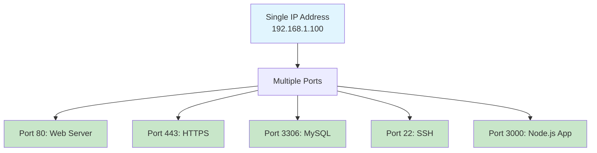
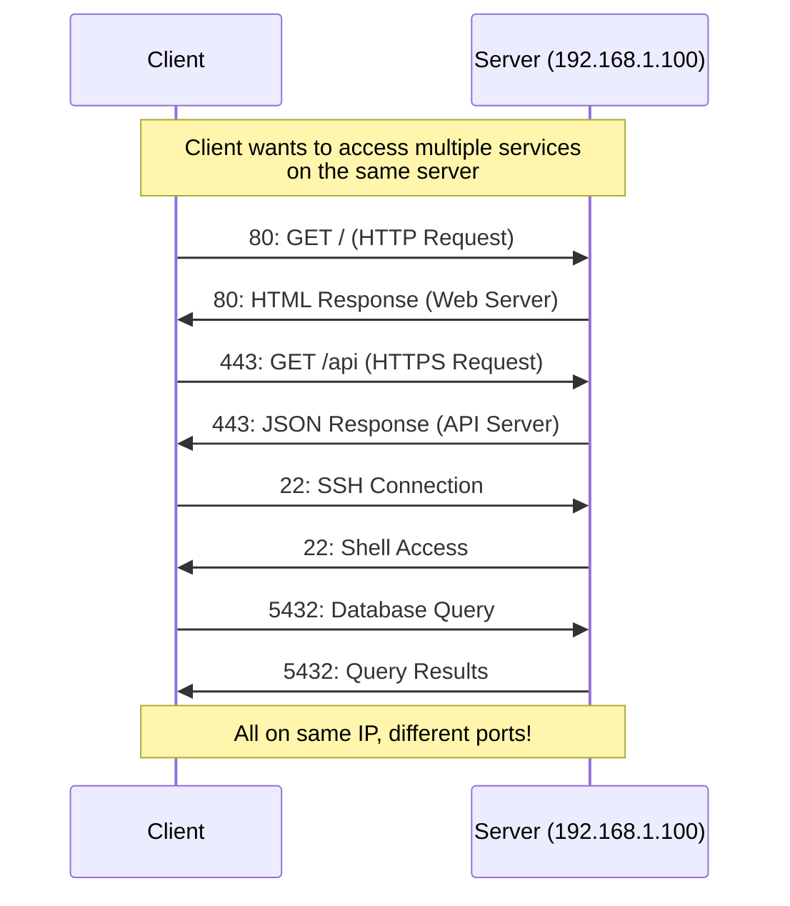
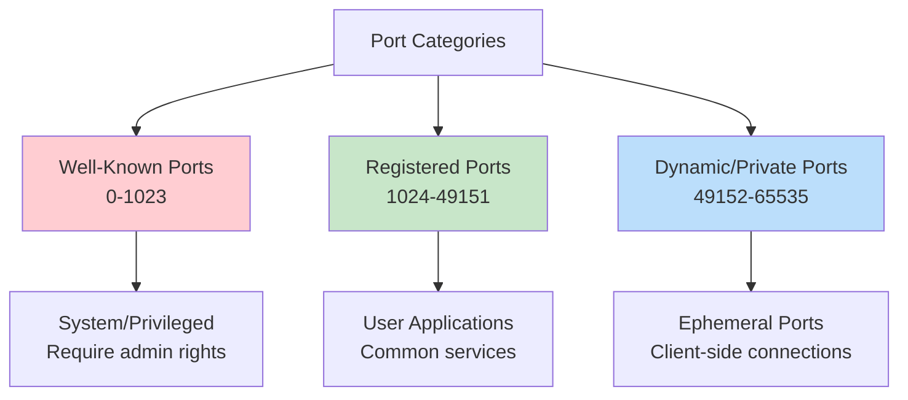
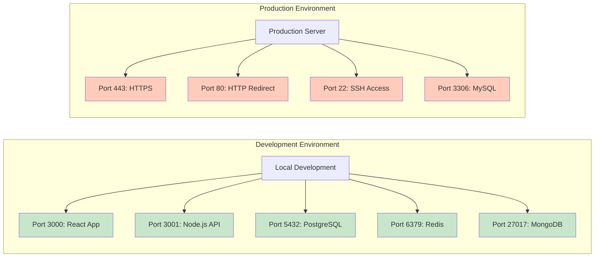

## Ports
A port is a virtual endpoint for network communications on a device, allowing multiple applications to use the network simultaneously through a single IP address.



**Simple analogy:** Ports are like apartment numbers in a building 🏢 – the IP is the building address, ports are individual apartments where different services live.

### How Ports Work


### Key Concepts:
- **Port Range:** 0 to 65535
- **Format:** IP:Port (e.g., 192.168.1.100:3000)
- **Purpose:** Multiplexing – multiple services on one IP
- **Transport Protocols:** TCP (reliable) and UDP (fast)

### Port Categories


### 1. Well-Known Ports (0-1023)
```bash
# System services, require admin privileges
20/21: FTP (File Transfer)
22: SSH (Secure Shell)
25: SMTP (Email)
53: DNS (Domain Name System)
80: HTTP (Web)
443: HTTPS (Secure Web)
3306: MySQL
5432: PostgreSQL
```

### 2. Registered Ports (1024-49151)
```bash
# Common application ports
27017: MongoDB
6379: Redis
8080: HTTP Alternate
3000: Node.js Development
4200: Angular Development
5000: Flask Development
8000: Django Development
9200: Elasticsearch
```

### 3. Dynamic/Private Ports (49152-65535)
- Ephemeral ports for client connections
- Assigned dynamically by operating system
- Short-lived connections

### Essential Ports Every Developer Should Know:
| Port  | Service        | Protocol | Description                    |
|------|----------------|----------|--------------------------------|
| 22   | SSH            | TCP      | Secure remote access          |
| 80   | HTTP           | TCP      | Unencrypted web traffic        |
| 443  | HTTPS          | TCP      | Encrypted web traffic          |
| 53   | DNS            | UDP/TCP  | Domain name resolution         |
| 25   | SMTP           | TCP      | Email sending                   |
| 3306 | MySQL          | TCP      | MySQL database                  |
| 5432 | PostgreSQL     | TCP      | PostgreSQL database             |
| 27017| MongoDB        | TCP      | MongoDB database                |
| 6379 | Redis          | TCP      | Redis cache/database            |
| 9200 | Elasticsearch  | TCP      | Search engine                   |
| 3000 | Node.js        | TCP      | Common dev port                 |
| 8080 | HTTP Alt       | TCP      | Alternative web port            |
| 9000 | PHP-FPM        | TCP      | PHP FastCGI                     |


### Ports in Development Workflow


### Development vs Production Ports:

| Environment       | Common Ports              | Notes |
|------------------|----------------------------|------|
| Local Development | 3000, 4200, 8080, 5000    | Avoid privileged ports |
| Docker            | Mapped ports (e.g., 8080:80) | Host:Container mapping |
| Production        | 443, 80, 22, 3306          | Standard service ports |
| Cloud             | Varies by service           | Often load balancer ports |

### Port Commands & Tools
```bash
# Check listening ports
netstat -tuln              # All listening ports
ss -tuln                   # Modern alternative
lsof -i -P -n              # Show processes using ports

# Check specific port
nc -zv localhost 3000      # Test if port is open
telnet localhost 3000      # Test TCP connection
nmap -p 3000 localhost     # Port scanning

# Port forwarding
ssh -L 5432:localhost:5432 user@server  # Local port forward
ssh -R 3000:localhost:3000 user@server  # Remote port forward

# Kill process on port
sudo lsof -ti:3000 | xargs kill -9      # Kill process on port 3000

# Find which process uses port
sudo netstat -tulnp | grep :3000
sudo ss -tulnp | grep :3000
```