## What is a Client?

A client is any device or application that requests data or services from a server.

In simple words:
- A client asks for something and the server provides it.

Whenever you visit a website, open an app, or press a button, you are using a client.

### Client vs Server Architecture


| Aspect          | Client                          | Server                               |
|--------------|----------------------------------|--------------------------------------|
| Role           | Initiates requests              | Responds to requests                |
| Location       | User's device                    | Remote data center / cloud          |
| Power          | Limited resources                | High computational power             |
| Data Access     | Never direct DB access           | Direct database access               |
| Responsibility  | UI/UX, user interaction          | Business logic, data processing      |
| Examples        | Chrome, Instagram app, VS Code   | AWS EC2, Google Cloud, DigitalOcean  |

### Types of Clients

```mermaid
mindmap
  root((Client Types))

    🌐 Web
      Browsers
      Web Apps
      PWAs

    📱 Mobile
      Native Apps
      React Native
      Flutter

    💻 Desktop
      Electron
      Native Apps
      Tauri

    🔌 API
      Postman
      CLI (cURL)
      Other Apps

    🤖 IoT
      Smart Devices
      Sensors

    🎮 Gaming
      Console
      PC
      Mobile

    ⚙️ Others
      CLI Tools
      Bots
      Legacy Systems

```



| Type           | Examples                          | Communication Protocol           |
|---------------|-----------------------------------|----------------------------------|
| Web Browsers  | Chrome, Firefox, Safari          | HTTP/HTTPS, WebSocket            |
| Mobile Apps   | Instagram, WhatsApp, TikTok       | REST API, GraphQL, gRPC          |
| Desktop Apps  | VS Code, Spotify, Slack           | HTTP, WebSocket, IPC              |
| API Clients   | Postman, cURL, frontend apps       | REST, GraphQL, SOAP               |
| IoT Devices   | Smart thermostats, wearables       | MQTT, CoAP, HTTP                  |
| Gaming Clients| PlayStation, Xbox, Steam           | Custom UDP/TCP protocols          |

### Real-World Client Flow
**Example:** Watching a YouTube Video


**Client's Role:** Initiate request → Render UI → Handle user interaction → Send analytics

### Client in Web Development Stack


### Client Technologies by Platform
| Platform        | Languages / Frameworks                     | Package Manager        |
|---------------|-----------------------------------------------|------------------------|
| Web          | HTML, CSS, JavaScript, React, Vue, Svelte      | npm, yarn, pnpm        |
| Mobile (Native) | Swift (iOS), Kotlin (Android)               | CocoaPods, Gradle       |
| Mobile (Cross)  | React Native, Flutter, Ionic               | npm, pub                 |
| Desktop      | Electron, Tauri, Flutter Desktop               | npm, cargo               |
| CLI Tools    | Node.js, Python, Go, Rust                     | npm, pip, cargo          |

### Client-Server Communication Patterns


### Communication Protocols
| Protocol             | Use Case                           | Client Example   |
|---------------------|------------------------------------|------------------|
| HTTP/HTTPS          | Web pages, REST APIs               | fetch(), Axios   |
| WebSocket           | Real-time chat, games               | WebSocket() API  |
| GraphQL             | Flexible data queries               | Apollo Client    |
| gRPC                | Microservices communication          | gRPC-Web         |
| MQTT                | IoT, low-bandwidth devices           | Paho MQTT        |
| Server-Sent Events  | Live updates, notifications          | EventSource      |

### Security Model: Client Limitations


### What Clients Should NEVER Do
1. Direct database access – Always go through APIs
2. Store secrets – API keys, passwords belong on server
3. Trust user input – Always validate on server
4. Implement critical business logic – Server handles this
5. Make security decisions – Server controls authorization

### What Clients SHOULD Do
- Validate UI inputs – For better UX
- Handle rendering/display – Presentation layer
- Manage local state – UI state, form data
- Cache data locally – For performance
- Handle errors gracefully – User-friendly messages

### Client Development Lifecycle


### Client Performance Optimization


### Optimization Techniques
| Technique           | Implementation                         | Benefit                 |
|--------------------|-----------------------------------------|--------------------------|
| Code Splitting      | Dynamic imports, route-based           | Faster initial load      |
| Lazy Loading        | Images, components on demand           | Reduced bandwidth        |
| Caching             | Service Workers, localStorage          | Offline capability       |
| CDN Usage           | Static assets on CDN                   | Global fast delivery      |
| Bundle Optimization | Tree-shaking, minification             | Smaller bundle size       |
| Image Optimization  | WebP, responsive images                | Faster media loading      |

### Essential Client Development Tools


### Tool Stack
| Category       | Tools                                               |
|--------------|-----------------------------------------------------|
| Development   | VS Code, WebStorm, Chrome DevTools                  |
| API Testing   | Postman, Insomnia, Thunder Client                   |
| Performance   | Lighthouse, WebPageTest, PageSpeed                  |
| Debugging     | React DevTools, Vue DevTools, Flipper              |
| Build Tools   | Vite, Webpack, esbuild, Parcel                      |
| Package Mgmt  | npm, yarn, pnpm, bun                                |
| Testing       | Jest, Cypress, Playwright, Vitest                   |


### Client Development Best Practices
```
# 1. Always use HTTPS
# 2. Implement proper error handling
try {
  const data = await fetch('/api');
} catch (error) {
  showUserFriendlyError();
}

# 3. Add loading states
const [loading, setLoading] = useState(true);

# 4. Handle offline scenarios
if (!navigator.onLine) {
  showOfflineMessage();
}

# 5. Implement proper caching
const cachedData = localStorage.getItem('data');

# 6. Use environment variables
const API_URL = process.env.REACT_APP_API_URL;

# 7. Add analytics/tracking (privacy-first)
# 8. Implement accessibility (a11y)
# 9. Test on multiple devices
# 10. Monitor client errors (Sentry)
```